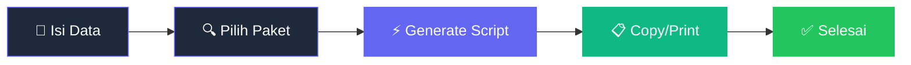

<div align="center">

# 🛠️ Tools Registrasi

**Sistem Registrasi Pelanggan NOC - Harmonika.id**

<div>
<a href="https://github.com/MMahesa/tools-registrasi">
    
</a>
<a href="https://github.com/MMahesa/tools-registrasi/fork">
    
</a>
<a href="https://github.com/MMahesa/tools-registrasi">
    
</a>
<a href="https://github.com/MMahesa/tools-registrasi">
    
</a>
</div>

<div>
<a href="https://mmahesa.github.io/tools-registrasi">
    
</a>
<a href="https://github.com/MMahesa">
    
</a>
<a href="https://harmonika.id">
    
</a>
</div>

<!-- Animated ASCII Art Banner -->
<pre>
<span style="color: #6366f1;">╔═════════════════════════════════════════════════════════╗</span>
<span style="color: #10b981;">║  🚀 <b>Tools Registrasi - Harmonika.id NOC System</b> 🚀      ║</span>
<span style="color: #6366f1;">║                                                         ║</span>
<span style="animation: pulse 2s infinite;">║  ⚡ <i>Modern Web-Based Customer Registration Tool</i> ⚡     ║</span>
<span style="color: #6366f1;">╚══════════════════════════════════════════ ══════════════╝</span>
</pre>

</div>

## 🎨 Workflow



**Tools registrasi pelanggan berbasis web untuk tim NOC Harmonika.id dengan interface modern dan fitur lengkap**

[▶️ Coba Demo](https://mmahesa.github.io/tools-registrasi) · [📖 Panduan](#-panduan-penggunaan) · [🚀 Quick Start](#-quick-start)

</div>

---

## 📋 Tentang

Tools Registrasi adalah aplikasi web berbasis HTML/CSS/JavaScript yang dirancang khusus untuk mempermudah tim NOC **Harmonika.id** dalam proses registrasi pelanggan baru dan penggantian modem. Dengan interface yang modern dan user-friendly, tools ini meningkatkan efisiensi kerja dan mengurangi error dalam proses input data untuk layanan internet Harmonika.id.

### 🎯 Fitur Utama

- 🌙 **Dark Theme Modern** - Interface gelap yang nyaman untuk penggunaan jangka panjang
- 📱 **Fully Responsive** - Sempurna di desktop, tablet, dan mobile
- ⚡ **Auto-Formatting** - Format otomatis untuk MAC address, username, dan redaman
- 🔍 **Smart Search** - Pencarian package yang cepat dan intuitif
- 📋 **One-Click Copy** - Salin hasil dengan satu klik
- 🖨️ **Print Ready** - Cetak dokumen dengan layout yang teroptimasi
- ⌨️ **Keyboard Shortcuts** - Pintasan keyboard untuk produktivitas maksimal
- 🔄 **Dual Mode** - Mode registrasi dan ganti modem dalam satu aplikasi

---

## 🚀 Quick Start

### 📋 Prerequisites
- Browser modern (Chrome 60+, Firefox 55+, Safari 12+, Edge 79+)
- Tidak perlu instalasi tambahan

### 🛠️ Installation

1. **Clone Repository**
   ```bash
   git clone https://github.com/MMahesa/tools-registrasi.git
   cd tools-registrasi
   ```

2. **Buka di Browser**
   ```bash
   # Method 1: Buka langsung
   open index.html
   
   # Method 2: Live server
   python -m http.server 8000
   # Kunjungi http://localhost:8000
   ```

3. **Mulai menggunakan!** 🎉

---

## 📖 Panduan Penggunaan

### 🎮 Mode Registrasi Pelanggan

1. **Isi Data Pelanggan**
   - Nama lengkap pelanggan
   - SN (Serial Number) modem
   - MAC Address (auto-format)
   - Redaman (auto-tambah dBm)
   - Username (auto-tambah @harmonika.id)
   - Password (default: 12345)

2. **Pilih Package**
   - Klik dropdown package
   - Gunakan search untuk cepat mencari
   - Pilih package yang sesuai

3. **Generate Script**
   - Tekan `Ctrl + Enter` atau klik tombol Generate
   - Script akan muncul di area output

### 🔧 Mode Ganti Modem

1. **Switch Mode**
   - Pilih "Ganti Modem" di mode selector
   - Form akan otomatis menyesuaikan

2. **Isi Data Modem**
   - Data yang dibutuhkan lebih minimalis
   - Fokus pada informasi hardware

### ⌨️ Keyboard Shortcuts

| Shortcut | Fungsi | Description |
|----------|--------|-------------|
| `Ctrl + Enter` | 🚀 Generate | Buat script dari form |
| `Ctrl + G` | ⚡ Generate | Alternatif generate |
| `Ctrl + Shift + C` | 📋 Copy | Salin output ke clipboard |
| `Ctrl + R` | 🗑️ Reset | Bersihkan semua form |

---

## 🎨 Customization

### 📍 Tambah ODP Location

Edit file `index.js`:
```javascript
const odpVlanMapping = {
    'EXISTING_ODP': 10,
    'NEW_LOCATION': 20,  // Tambah ODP baru
    'ANOTHER_ONE': 30   // Tambah VLAN mapping
};
```

### 📦 Modifikasi Package List

Update array `paketOptions`:
```javascript
const paketOptions = [
    'Paket UP TO 25 Mbps',
    'Paket UP TO 50 Mbps',
    'Paket UP TO 100 Mbps',  // Tambah package baru
    'Paket UP TO 200 Mbps'
];
```

### 🎨 Theme Customization

Edit CSS variables di `styles.css`:
```css
:root {
    --primary-color: #6366f1;    /* Ganti warna utama */
    --success-color: #10b981;     /* Ganti warna sukses */
    --bg-primary: #0f172a;       /* Ganti background */
    --text-primary: #f1f5f9;     /* Ganti warna teks */
}
```

---

## 📁 Project Structure

```
tools-registrasi/
├── 📄 index.html          # Main HTML structure
├── 🎨 styles.css          # Complete styling with dark theme
├── ⚡ index.js           # All JavaScript functionality
└── 📖 README.MD          # Documentation file
```

### 🔧 Teknologi yang Digunakan

- **HTML5** - Semantic markup structure
- **CSS3** - Modern CSS with Grid, Flexbox, Custom Properties
- **ES6+ JavaScript** - Arrow functions, Template literals, Modern APIs
- **Responsive Design** - Mobile-first approach
- **No Build Process** - Pure static files

---

## 🌐 Browser Support

| Browser | Version | Support | Features |
|---------|---------|---------|----------|
| 🟢 Chrome | 60+ | ✅ Full | All features |
| 🟠 Firefox | 55+ | ✅ Full | All features |
| 🔵 Safari | 12+ | ✅ Full | All features |
| 🟣 Edge | 79+ | ✅ Full | All features |

---

## 🤝 Contributing

**Kontribusi sangat welcome!** 🎉

1. **Fork** repository ini
2. **Buat branch** baru (`git checkout -b feature/AmazingFeature`)
3. **Commit** perubahan (`git commit -m '✨ Add some AmazingFeature'`)
4. **Push** ke branch (`git push origin feature/AmazingFeature`)
5. **Buka Pull Request**

### 📝 Code Style Guidelines

- Gunakan **2 spaces** untuk indentation
- Follow **camelCase** untuk variables/functions
- Add **semantics** HTML5 elements
- Include **alt text** untuk images
- Write **clear comments** untuk complex logic

---

## 📊 Statistics

<div align="center">


</div>

---

## 🗓️ Changelog

### 🎉 v1.0.0 (Release Pertama)
- ✨ Initial release
- 🎨 Modern dark theme interface
- 📱 Fully responsive design
- ⚡ Auto-format input fields
- 🔍 Searchable package dropdown
- 📋 Copy to clipboard functionality
- 🖨️ Optimized print styles
- ⌨️ Keyboard shortcuts support
- 🔄 Dual mode (registrasi/ganti modem)

---

## 🙏 Credits & Terima Kasih

- 💜 Dibuat dengan ❤️ untuk tim **Harmonika.id**
- 🎨 Inspired by modern web design principles
- 🚀 Powered by pure HTML/CSS/JavaScript
- 📚 Documentation inspired by awesome open-source projects
- 🌐 Specialized for Harmonika.id NOC operations

---

## 📄 License

Project ini dilisensikan under **MIT License** - lihat file [LICENSE](LICENSE) untuk details.

---

## 📞 Contact & Support

- **GitHub**: [@MMahesa](https://github.com/MMahesa)
- **Issues**: [Report Bug](https://github.com/MMahesa/tools-registrasi/issues)
- **Features**: [Request Feature](https://github.com/MMahesa/tools-registrasi/issues/new?template=feature_request.md)
- **Harmonika.id**: [Official Website](https://harmonika.id)

---

<div align="center">

**[⬆️ Kembali ke Atas](#-tools-registrasi)**

Made with 💜 by **[MMahesa](https://github.com/MMahesa)** for **Harmonika.id** 🚀

[](https://github.com/MMahesa)
[](https://harmonika.id)

</div>